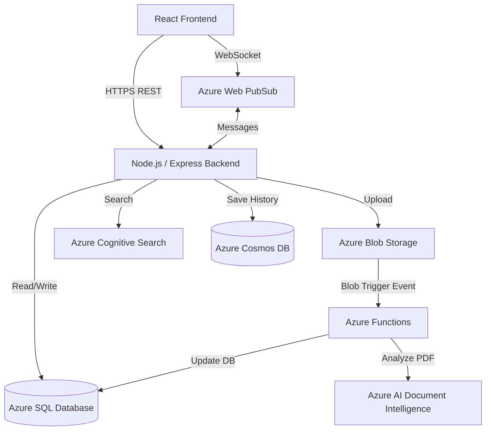

# PlacementHub Architecture and Workflow

This document provides a detailed overview of the system architecture and the step-by-step workflow for the core processes within PlacementHub.

## 1. System Architecture Flow

The system is designed as a decoupled, event-driven web application. It relies on a React frontend and an Express/Node.js backend, heavily integrated with Azure PaaS (Platform as a Service) resources.

### High-Level Architecture Diagram

### Component Architecture
1. **Frontend Layer (Client)**
   - Built with **React.js**.
   - Communicates with the backend via standard HTTP/REST calls.
   - For real-time chat, it connects asynchronously via WebSocket to **Azure Web PubSub**.

2. **API Layer (Backend)**
   - Built with **Node.js** & **Express**.
   - Handles authentication, request validation, business logic, and database operations.
   - Interfaces heavily with Azure SDKs to interact with various Azure resources.

3. **Data Layer**
   - **Azure SQL Database:** The source of truth for structured data. Stores `Students`, `Companies`, `Jobs`, and `Applications`.
   - **Azure Cosmos DB:** Used exclusively for high-throughput saving and retrieving of chat message history.

4. **Event-Driven & AI Layer**
   - **Azure Functions:** A serverless component that waits for new files to land in Blob Storage.
   - **Azure AI Document Intelligence (Form Recognizer):** An AI service called by the Azure Function to parse resume documents and pull out text and skills.

---

## 2. Core Workflows

### A. AI Resume Upload and Processing Workflow
This workflow highlights the asynchronous event-driven capabilities of the platform.

1. **Upload Request:** A student clicks "Upload Resume" in the React frontend.
2. **File Transfer:** The frontend sends the file via a multi-part form HTTP POST request to the Node.js backend.
3. **Blob Storage:** The backend takes the file buffer and securely uploads it directly to an **Azure Blob Storage** container (`resumes`).
4. **Trigger Fired:** The moment the file lands in the container, it triggers a serverless **Azure Function** (`ResumeProcessor`).
5. **AI Extraction:** The Azure Function takes the newly uploaded file and sends it to **Azure AI Document Intelligence**.
6. **Data Processing:** AI Document Intelligence parses the document, pulling out contact info, education, and specific technical skills (e.g., "Python", "React", "SQL").
7. **Database Update:** The Azure Function takes the parsed skills and updates the student's record in the **Azure SQL Database**.
8. **Completion:** The student's profile now automatically reflects their skills without manual data entry.

### B. Company Candidate Search Workflow
1. **Search Query:** A company navigates to the search page and enters a required skill (e.g., "Node.js").
2. **Search API Call:** The frontend calls the backend search endpoint (`/api/companies/search?skills=Node.js`).
3. **Cognitive Search:** The backend formats the request and queries **Azure Cognitive Search**, which holds an optimized, searchable index of all student profiles and skills.
4. **Scoring:** Cognitive Search instantly returns a list of candidate profiles ranked by relevance to the query.
5. **Display Results:** The backend returns this list to the frontend, which renders the candidate profiles for the company to review.

### C. Real-Time Chat Workflow
1. **Initialization:** When a student or company opens the chat window, the frontend requests an access token from the backend.
2. **Token Generation:** The backend uses the Azure SDK to generate a temporary **Azure Web PubSub** access token and returns it to the frontend.
3. **WebSocket Connection:** The frontend uses the token to open a persistent WebSocket connection directly with the Azure Web PubSub service.
4. **Sending a Message:**
   - User A types a message and hits send.
   - The message goes directly to the backend API (`/api/chat/message`).
5. **Persistence & Broadcast:**
   - **1. Persistence:** The backend immediately saves the message document into **Azure Cosmos DB** so the history is preserved for later.
   - **2. Broadcast:** The backend uses the Web PubSub SDK to emit the message to the specific user's channel/hub.
6. **Receiving a Message:** Azure Web PubSub pushes the incoming message down the open WebSocket connection to User B's frontend, instantly updating their UI without a page refresh.
